<!-- ===== ANIMATED HEADER ===== -->

<picture>
  <source media="(prefers-color-scheme: dark)"  srcset="./assets/profile-header-dark.svg" />
  <source media="(prefers-color-scheme: light)" srcset="./assets/profile-header-light.svg" />
  
</picture>

 

 

<!-- ===== WHOAMI ===== -->
## `>_ whoami`

<picture>
  <source media="(prefers-color-scheme: dark)"  srcset="./assets/whoami-dark.svg" />
  <source media="(prefers-color-scheme: light)" srcset="./assets/whoami-light.svg" />
  
</picture>

<!-- ===== STACK ===== -->
## `>_ stack`

  
  
  
  
  
  
  
  
  
  
  
  

<!-- ===== EEG DIVIDER (scrolling) ===== -->
<picture>
  <source media="(prefers-color-scheme: dark)"  srcset="./assets/eeg-divider-dark.svg" />
  <source media="(prefers-color-scheme: light)" srcset="./assets/eeg-divider-light.svg" />
  
</picture>

<!-- ===== STATS ===== -->
## `>_ stats`

 

<!-- ===== ACTIVITY ===== -->
## `>_ activity`

---

No ML No Life.

