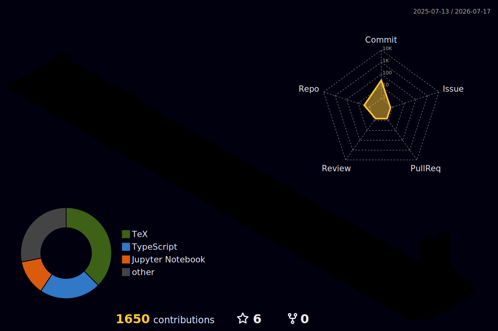

<!-- ===== ANIMATED HEADER ===== -->
<div align="center">

<picture>
  <source media="(prefers-color-scheme: dark)"  srcset="./assets/profile-header-dark.svg" />
  <source media="(prefers-color-scheme: light)" srcset="./assets/profile-header-light.svg" />
  
</picture>

<br/>


<br/>

<a href="https://github.com/yu531deve">
  
</a>
<a href="https://github.com/yu531deve">
  
</a>

</div>

<!-- ===== WHOAMI ===== -->
## `>_ whoami`

ML Engineer working at the intersection of **neuroscience and machine learning** —
building EEG / sleep-stage models and exploring neural operators (FNO / PINN) for inverse problems.

```text
role     ML Engineer @ FastNeura
focus    brain dynamics · neural field theory · physics-informed ML
based    Tokyo, Japan
```

<p>
  <a href="mailto:YOUR_EMAIL"></a>
  &nbsp;
  <a href="YOUR_SITE_OR_SCHOLAR"></a>
</p>

<!-- ===== EEG DIVIDER ===== -->
<picture>
  <source media="(prefers-color-scheme: dark)"  srcset="./assets/eeg-divider-dark.svg" />
  <source media="(prefers-color-scheme: light)" srcset="./assets/eeg-divider-light.svg" />
  
</picture>

<!-- ===== TROPHIES ===== -->
## `>_ trophies`

<div align="center">


</div>

<!-- ===== 3D CONTRIBUTION GRAPH (generated by the same workflow) ===== -->
## `>_ 3d activity`

<div align="center">

<picture>
  <source media="(prefers-color-scheme: dark)"  srcset="./profile-3d-contrib/profile-night-rainbow.svg" />
  <source media="(prefers-color-scheme: light)" srcset="./profile-3d-contrib/profile-season-animate.svg" />
  
</picture>

</div>

<!-- ===== DEV QUOTE ===== -->
<div align="center">


</div>

---

<div align="center">
<sub>No ML No Life.</sub>
</div>
